# Quipux Earthquake Monitor

Sistema de monitoreo sísmico que ingesta eventos del feed público de USGS, calcula métricas horarias y genera reportes consolidados mediante Apache Airflow. Expone los datos a través de una API REST paginada.

---

## Características

- Ingesta continua del feed `all_hour` de USGS con deduplicación automática por `event_id`.
- Cálculo incremental de métricas agregadas por ventana UTC de una hora.
- Generación de reportes horarios orquestada por Airflow.
- API REST con paginación, filtros temporales y ordenamiento.
- Almacenamiento en MongoDB con índices únicos que garantizan idempotencia.
- Todos los componentes corren en contenedores Docker aislados.

---

## Arquitectura resumida



- [Documentación detallada de arquitectura](docs/architecture.md)
- [Fuente editable Mermaid](docs/architecture-diagram.mmd)

- **ingestion-worker**: proceso independiente que consulta USGS y persiste en MongoDB.
- **Airflow**: orquesta la tarea `generate_hourly_report` cada hora en punto (UTC).
- **api**: expone solo los datos ya persistidos; no calcula ni recalcula nada.

---

## Tecnologías

| Componente        | Versión / Paquete              |
|-------------------|-------------------------------|
| Python            | 3.12                          |
| FastAPI           | fastapi                       |
| Uvicorn           | uvicorn[standard]             |
| Pydantic          | pydantic, pydantic-settings   |
| Motor / PyMongo   | motor, pymongo                |
| HTTPX             | httpx                         |
| MongoDB           | 7                             |
| Apache Airflow    | 3.3.0                         |
| PostgreSQL        | 16 (metadatos de Airflow)     |
| Pytest            | pytest, pytest-cov            |
| Docker            | Docker y Docker Compose       |

---

## Requisitos previos

- Docker con Docker Compose (versión con soporte para `compose` como subcomando).
- Puertos locales disponibles: **8000** (API), **8080** (Airflow), **27017** (MongoDB).

---

## Configuración

Docker Compose carga `.env.example` como configuración base obligatoria y `.env` como sobrescritura local opcional. No es necesario crear `.env` para ejecutar con los valores predeterminados.

Para personalizar la configuración:

```powershell
# PowerShell
Copy-Item .env.example .env
```

```bash
# Bash
cp .env.example .env
```

Edita `.env` para cambiar credenciales, URI de MongoDB u otros parámetros. Las credenciales incluidas en `.env.example` son únicamente para desarrollo local y deben reemplazarse en cualquier entorno distinto.

### Variables principales

| Variable                          | Descripción                              |
|-----------------------------------|------------------------------------------|
| `APP_NAME`                        | Nombre de la aplicación                  |
| `APP_ENV`                         | Entorno (`development`, `production`)    |
| `LOG_LEVEL`                       | Nivel de log (`INFO`, `DEBUG`, etc.)     |
| `MONGO_URI`                       | URI de conexión a MongoDB                |
| `MONGO_DATABASE`                  | Nombre de la base de datos               |
| `USGS_URL`                        | URL del feed GeoJSON de USGS             |
| `USGS_TIMEOUT_SECONDS`            | Tiempo límite de la solicitud USGS       |
| `INGESTION_INTERVAL_SECONDS`      | Intervalo entre iteraciones de ingesta   |
| `API_HOST`                        | Host donde escucha la API                |
| `API_PORT`                        | Puerto interno configurado en Settings. El Dockerfile y el mapeo actual de Docker Compose usan explícitamente el puerto `8000`; cambiar solo esta variable no modifica el puerto publicado al host |
| `DEFAULT_PAGE_SIZE`               | Tamaño de página predeterminado          |
| `MAX_PAGE_SIZE`                   | Tamaño de página máximo                  |
| `POSTGRES_USER`                   | Usuario de PostgreSQL (Airflow)          |
| `POSTGRES_PASSWORD`               | Contraseña de PostgreSQL (Airflow)       |
| `POSTGRES_DB`                     | Base de datos de PostgreSQL (Airflow)    |
| `AIRFLOW__DATABASE__SQL_ALCHEMY_CONN` | Cadena de conexión de Airflow        |
| `AIRFLOW__API_AUTH__JWT_SECRET`   | Secreto JWT de Airflow                   |
| `AIRFLOW__API__SECRET_KEY`        | Clave secreta de la API de Airflow       |
| `AIRFLOW__CORE__FERNET_KEY`       | Clave Fernet para cifrado de Airflow     |

---

## Inicio rápido

```bash
docker compose up -d --build
```

Verificar estado de los servicios:

```bash
docker compose ps -a
```

`airflow-init` aparecerá como `Exited (0)` después de completar la inicialización. Eso es normal.

Ver logs en tiempo real:

```bash
docker compose logs -f api
docker compose logs -f ingestion-worker
docker compose logs -f airflow-scheduler
```

Detener los servicios (conservando datos):

```bash
docker compose down
```

> **Advertencia destructiva:** el siguiente comando elimina los volúmenes y todos los datos persistidos:
> ```bash
> docker compose down -v
> ```

---

## Servicios y URLs

### Servicios web

| Servicio            | URL                              |
|---------------------|----------------------------------|
| API REST            | http://localhost:8000            |
| Swagger UI          | http://localhost:8000/docs       |
| OpenAPI JSON        | http://localhost:8000/openapi.json |
| Airflow             | http://localhost:8080            |

### MongoDB

MongoDB no es un servicio web. No se puede abrir `mongodb://localhost:27017` en un navegador.

Para conectarse se puede usar:

- [MongoDB Compass](https://www.mongodb.com/products/compass)
- `mongosh`
- Cualquier controlador compatible con MongoDB

Acceso interactivo mediante el contenedor:

```bash
docker compose exec mongodb mongosh earthquake_monitor
```

Verificación de conectividad:

```bash
docker compose exec -T mongodb mongosh --quiet earthquake_monitor --eval "db.runCommand({ ping: 1 })"
```

Cadena de conexión desde el host: `mongodb://localhost:27017/earthquake_monitor`

### Autenticación en Airflow

Airflow 3.3.0 utiliza **Simple Auth Manager**, destinado a desarrollo y pruebas.

El usuario configurado es `admin`. La contraseña se genera localmente durante la inicialización de Airflow.

> **Nota:** La salida del comando de configuración puede mostrar `admin:admin`, donde el segundo valor indica el **rol**, no la contraseña.

Las variables `_AIRFLOW_WWW_USER_USERNAME` y `_AIRFLOW_WWW_USER_PASSWORD` de `.env.example` no controlan las credenciales efectivas cuando está activo Simple Auth Manager.

Para confirmar el usuario configurado:

```bash
docker compose exec -T airflow-api-server airflow config get-value core simple_auth_manager_users
```

Para consultar la contraseña generada localmente:

```bash
docker compose exec -T airflow-api-server sh -lc 'cat "$AIRFLOW_HOME/simple_auth_manager_passwords.json.generated"'
```

---

## API REST

### Rutas disponibles

| Método | Ruta          | Descripción                                |
|--------|---------------|--------------------------------------------|
| GET    | `/`           | Mensaje de bienvenida                      |
| GET    | `/health`     | Estado de salud de la API                  |
| GET    | `/earthquakes`| Lista paginada de eventos sísmicos         |
| GET    | `/metrics`    | Lista paginada de métricas horarias        |
| GET    | `/reports`    | Lista paginada de reportes horarios        |

### Parámetros comunes

| Parámetro    | Descripción                                    | Valor predeterminado |
|--------------|------------------------------------------------|----------------------|
| `page`       | Número de página (comienza en 1)               | `1`                  |
| `page_size`  | Tamaño de página (máximo 100)                  | `20`                 |
| `start_time` | Filtro de inicio (debe incluir zona horaria)   | —                    |
| `end_time`   | Filtro de fin (debe incluir zona horaria)      | —                    |
| `sort`       | Orden: `asc` o `desc`                          | `desc`               |

**Reglas de validación:**

- `page` debe ser >= 1.
- `page_size` debe ser entre 1 y 100.
- `start_time` y `end_time` deben incluir información de zona horaria. Las fechas sin zona horaria producen HTTP 422.
- Los datetimes con offset se normalizan a UTC internamente.
- `start_time` no puede ser posterior a `end_time`.
- Parámetros desconocidos producen HTTP 422.

### Parámetros exclusivos de `/earthquakes`

| Parámetro       | Descripción                            |
|-----------------|----------------------------------------|
| `min_magnitude` | Magnitud mínima (número finito, puede ser negativo) |
| `max_magnitude` | Magnitud máxima (número finito)        |

`min_magnitude` no puede ser mayor que `max_magnitude`. Ambos son opcionales. Valores no finitos (NaN, infinito) producen HTTP 422.

### Estructura de respuesta paginada

```json
{
  "items": [],
  "page": 1,
  "page_size": 20,
  "total": 0,
  "total_pages": 0
}
```

---

## Ejemplos de uso

### Verificar salud de la API

```bash
curl http://localhost:8000/health
```

### Sismos recientes (segunda página, 10 por página)

```bash
curl "http://localhost:8000/earthquakes?page=2&page_size=10"
```

### Sismos filtrados por magnitud mínima

```bash
curl "http://localhost:8000/earthquakes?min_magnitude=4.0"
```

### Sismos filtrados por rango de tiempo

```bash
curl "http://localhost:8000/earthquakes?start_time=2024-06-01T00:00:00Z&end_time=2024-06-01T23:59:59Z"
```

Con offset horario (se codifica el `+` como `%2B`):

```bash
curl "http://localhost:8000/earthquakes?start_time=2024-06-01T05:00:00%2B05:00"
```

### Métricas en orden ascendente

```bash
curl "http://localhost:8000/metrics?sort=asc"
```

### Reportes paginados

```bash
curl "http://localhost:8000/reports?page=1&page_size=5"
```

### Reportes filtrados por rango de tiempo

```bash
curl "http://localhost:8000/reports?start_time=2024-06-01T00:00:00Z&end_time=2024-06-30T23:59:59Z"
```

---

## Flujo de ingesta

`ingestion-worker` se ejecuta como proceso independiente y realiza el siguiente ciclo de forma indefinida:

1. Consulta el feed GeoJSON `all_hour` de USGS (eventos de la última hora).
2. Transforma cada feature al modelo interno `Earthquake`.
3. Intenta insertar cada evento en la colección `earthquakes` usando `insert_if_new`.
   - Si `event_id` ya existe (índice único), el evento se contabiliza como duplicado y se omite.
   - Solo los eventos **nuevos** actualizan las métricas de la ventana horaria correspondiente.
4. Registra el resultado de la iteración (fetched / inserted / duplicates / invalid).
5. Espera el intervalo configurado (predeterminado: 180 segundos) y repite.

Los errores de una iteración se registran con nivel `ERROR` y el worker continúa con la siguiente iteración.

---

## Reportes con Airflow

### DAG: `hourly_report_dag`

| Propiedad          | Valor                    |
|--------------------|--------------------------|
| DAG ID             | `hourly_report_dag`      |
| Tarea              | `generate_hourly_report` |
| Schedule           | `0 * * * *` (cada hora en punto, UTC) |
| Catchup            | `false`                  |
| Max active runs    | `1`                      |
| Retries            | `2`                      |
| Retry delay        | 5 minutos                |

**Funcionamiento:**

- Airflow determina la hora a reportar a partir de `data_interval_end` del contexto de la tarea.
- La tarea invoca `ReportingService.generate_hourly_report(report_date)`.
- `ReportingService` consulta `EarthquakeRepository` y persiste el resultado en `hourly_reports` mediante `ReportRepository`.
- `report_date` identifica de forma única cada hora. Reejecutar la misma hora actualiza el documento existente sin crear duplicados.
- Airflow solo orquesta; toda la lógica de cálculo reside en `ReportingService`.

**La API no genera ni recalcula reportes.** `GET /reports` consulta únicamente los reportes ya persistidos en `hourly_reports`.

---

## Persistencia e índices

### Colecciones

| Colección        | Contenido                                      |
|------------------|------------------------------------------------|
| `earthquakes`    | Eventos sísmicos individuales del feed USGS    |
| `metrics`        | Métricas agregadas por ventana UTC de una hora |
| `hourly_reports` | Reportes horarios consolidados                 |

### Índices

**`earthquakes`**

| Índice                                    | Campos                                | Único |
|-------------------------------------------|---------------------------------------|-------|
| `earthquakes_event_id_unique`             | `event_id` ASC                        | Sí    |
| `earthquakes_event_time_desc`             | `event_time` DESC                     | No    |
| `earthquakes_magnitude_asc_event_time_desc` | `magnitude` ASC, `event_time` DESC  | No    |

**`metrics`**

| Índice                      | Campos            | Único |
|-----------------------------|-------------------|-------|
| `metrics_window_start_unique` | `window_start` ASC | Sí   |

**`hourly_reports`**

| Índice                              | Campos           | Único |
|-------------------------------------|------------------|-------|
| `hourly_reports_report_date_unique` | `report_date` ASC | Sí   |

Los mecanismos de idempotencia difieren por colección:

- **`earthquakes`**: `insert_if_new` intenta insertar el evento. Si `event_id` ya existe, MongoDB produce `DuplicateKeyError`; el evento se trata como duplicado y **no** se modifica el documento existente ni se actualizan métricas.
- **`metrics`**: `replace_one` con `upsert=True` sobre `window_start`; el documento existente se reemplaza con los valores actualizados.
- **`hourly_reports`**: `replace_one` con `upsert=True` sobre `report_date`; el documento existente se reemplaza al reejecutar la misma hora.

La idempotencia del flujo completo resulta de la combinación: deduplicación de eventos por `DuplicateKeyError`, actualización incremental de métricas solo para eventos nuevos, y upsert de métricas y reportes.

---

## Pruebas

Ejecutar la suite completa de la API y los workers:

```bash
docker compose run --rm --build api pytest -q
```

Con cobertura:

```bash
docker compose run --rm --build api pytest --cov=app --cov-report=term-missing
```

```powershell
# PowerShell (una sola línea)
docker compose run --rm --build api pytest --cov=app --cov-report=term-missing
```

Ejecutar pruebas del DAG de Airflow (requiere el perfil `debug`):

```bash
docker compose --profile debug run --rm airflow-cli pytest tests/airflow/ -q
```

---

## Colección Postman

`postman/quipux-earthquakes.postman_collection.json` contiene una colección Postman v2.1 con smoke tests, consultas paginadas con filtros y ordenamiento, y casos de validación HTTP 422. Todas las solicitudes usan la variable `{{baseUrl}}`.

### Requisito previo — entorno en ejecución

La colección requiere que la API esté disponible en `http://localhost:8000`. Iniciar el entorno antes de ejecutar las pruebas:

```bash
docker compose up -d --build
```

### Importar en Postman

Abrir Postman → **Import** → seleccionar `postman/quipux-earthquakes.postman_collection.json`.

Una vez importada, ejecutar con **Collection Runner** (botón ▶ junto al nombre de la colección). El runner ejecuta todos los requests en orden y muestra el resultado de cada script de prueba.

### Ejecutar con Newman (línea de comandos)

Newman es el runner CLI oficial de Postman. Requiere Node.js instalado previamente.

Instalar Newman:

```bash
npm install -g newman
```

Ejecutar la colección:

```bash
newman run postman/quipux-earthquakes.postman_collection.json
```

Newman imprime un resumen de cada request con el resultado de los scripts de prueba. Los requests de la carpeta `04 - Validation Errors` deben devolver `HTTP 422`; Newman los marca como pasados si el script de prueba verifica ese código de estado.

### Variables de colección

| Variable        | Valor predeterminado        |
|----------------|-----------------------------|
| `baseUrl`      | `http://localhost:8000`     |
| `page`         | `1`                         |
| `pageSize`     | `5`                         |
| `sort`         | `desc`                      |
| `startTime`    | `2000-01-01T00:00:00Z`      |
| `endTime`      | `2100-01-01T00:00:00Z`      |
| `minMagnitude` | `0`                         |
| `maxMagnitude` | `10`                        |

### Carpetas y solicitudes

| Carpeta                    | Solicitudes                                                                                              |
|----------------------------|----------------------------------------------------------------------------------------------------------|
| `00 - Smoke`               | Root, Health                                                                                             |
| `01 - Earthquakes`         | List Earthquakes - Defaults, List Earthquakes - Pagination, List Earthquakes - Time Range and Ascending Sort, List Earthquakes - Magnitude Range |
| `02 - Metrics`             | List Metrics - Defaults, List Metrics - Time Range and Ascending Sort                                   |
| `03 - Reports`             | List Reports - Defaults, List Reports - Pagination, List Reports - Time Range and Ascending Sort         |
| `04 - Validation Errors`   | Invalid Page, Page Size Above Maximum, Invalid Sort, Datetime Without Timezone, Inverted Time Range, Inverted Magnitude Range, Unknown Query Parameter |

Todas las solicitudes son `GET`. Cada una incluye un script de prueba Postman que verifica el código de estado y la estructura de la respuesta.

---

## Estructura del proyecto

```
quipux-earthquake-monitor/
├── app/
│   ├── api/
│   │   ├── dependencies.py      # Inyección de dependencias FastAPI
│   │   ├── main.py              # Aplicación FastAPI y ciclo de vida
│   │   ├── schemas.py           # Modelos de query params y respuesta paginada
│   │   └── routes/
│   │       ├── earthquakes.py   # GET /earthquakes
│   │       ├── health.py        # GET /health
│   │       ├── metrics.py       # GET /metrics
│   │       └── reports.py       # GET /reports
│   ├── clients/
│   │   └── usgs_client.py       # Cliente HTTP para el feed de USGS
│   ├── config/
│   │   ├── logging.py           # Configuración de logging
│   │   └── settings.py          # Settings derivadas de variables de entorno
│   ├── database/
│   │   ├── indexes.py           # Creación de índices MongoDB
│   │   └── mongodb.py           # Conexión Motor (AsyncIOMotorClient)
│   ├── models/
│   │   ├── earthquake.py        # Modelo de dominio Earthquake
│   │   ├── metric.py            # Modelo de dominio Metric
│   │   └── report.py            # Modelo de dominio Report
│   ├── repositories/
│   │   ├── earthquake_repository.py
│   │   ├── metric_repository.py
│   │   └── report_repository.py
│   ├── services/
│   │   ├── ingestion_service.py  # Fetch → transform → store
│   │   ├── metrics_service.py    # Actualización de métricas horarias
│   │   └── reporting_service.py  # Cálculo de reportes horarios
│   └── workers/
│       └── ingestion_worker.py   # Loop de ingesta periódica
├── airflow/
│   └── dags/
│       └── hourly_report_dag.py  # DAG hourly_report_dag
├── tests/
│   ├── airflow/
│   │   └── test_hourly_report_dag.py
│   └── unit/
│       └── (pruebas unitarias de todos los módulos)
├── docs/
│   ├── architecture.md
│   ├── architecture-diagram.mmd
│   └── architecture-diagram.svg
├── docker-compose.yml
├── Dockerfile
├── postman/
│   └── quipux-earthquakes.postman_collection.json
├── Dockerfile.airflow
├── .env.example
├── requirements.txt
└── requirements-airflow.txt
```

---

## Decisiones técnicas

### Procesos independientes
API, ingestion-worker y Airflow se ejecutan como procesos y contenedores separados con ciclos de vida propios. La caída de un proceso no detiene directamente los demás contenedores. La API puede continuar consultando datos persistidos aunque el worker esté detenido.

MongoDB es una dependencia compartida: su indisponibilidad puede afectar a la API, al worker de ingesta y a la tarea de Airflow simultáneamente. `airflow-postgres` es una dependencia compartida de los componentes Airflow.

### Separación por capas
Las rutas FastAPI no realizan consultas directas a las colecciones de MongoDB. Los repositorios concentran las consultas y escrituras de datos de dominio. `app/database/mongodb.py` administra la conexión y proporciona la base activa; `app/database/indexes.py` administra la creación de índices.

Los endpoints de consulta (`GET /earthquakes`, `GET /metrics`, `GET /reports`) siguen el flujo: ruta → validación Pydantic → repositorio (vía dependencia inyectada) → MongoDB → respuesta paginada. No pasan por una capa de servicio.

Los procesos de negocio sí usan servicios: `IngestionService` coordina la ingesta (incluye llamadas a `USGSClient`) y delega en `MetricsService` para actualizar métricas; `ReportingService` calcula y persiste reportes desde el DAG de Airflow.

### API de solo lectura sobre datos persistidos
FastAPI expone únicamente datos ya almacenados. La lógica de cálculo reside en `IngestionService`, `MetricsService` y `ReportingService`, no en las rutas.

### Índices únicos para idempotencia
`event_id` en `earthquakes`, `window_start` en `metrics` y `report_date` en `hourly_reports` impiden duplicados aunque el mismo proceso se ejecute varias veces.

### Métricas calculadas incrementalmente
Solo los eventos **nuevos** actualizan las métricas. Los duplicados detectados por `insert_if_new` se omiten, evitando recuentos incorrectos.

### Airflow orquesta, ReportingService calcula
El DAG determina la ventana horaria a procesar y delega todo el cálculo a `ReportingService`. El DAG no contiene lógica de negocio.

### LocalExecutor con paralelismo limitado
El entorno local usa `LocalExecutor` con paralelismo 1 (`AIRFLOW__CORE__PARALLELISM=1`). Es suficiente para el volumen de un DAG horario con una sola tarea.

### PostgreSQL solo para metadatos de Airflow
MongoDB almacena los datos de dominio. PostgreSQL es la base de metadatos de Airflow y no se usa para ningún otro propósito.

### Volúmenes para persistencia
`mongo_data`, `airflow_postgres_data` y `airflow_logs` preservan los datos entre reinicios. `docker compose down` (sin `-v`) no los elimina.

---

## Solución de problemas

### Puerto 8000 ocupado

Identificar el proceso que ocupa el puerto y detenerlo, o modificar el mapeo
de puertos del servicio `api` en `docker-compose.yml`:

```yaml
ports:
  - "8001:8000"
```

El puerto interno `8000` es donde Uvicorn escucha dentro del contenedor.
Cambiar únicamente `API_PORT` en `.env` no modifica el puerto publicado al host.

### Puerto 8080 ocupado

Modificar el mapeo de `airflow-api-server` en `docker-compose.yml` o liberar el puerto.

### API sin respuesta / error de base de datos

`api` depende de `mongodb` para completar su inicialización. Si MongoDB no está
disponible durante el arranque, la API puede no completar el ciclo de vida y
no responder solicitudes.

Si una solicitud llega mientras MongoDB no está accesible, `get_db()` puede
responder `HTTP 503`. Los errores inesperados del repositorio producen `HTTP 500`.

Verificar y recuperar MongoDB:

```bash
docker compose logs mongodb
docker compose restart mongodb
```

### Componentes Airflow en estado `unhealthy`

`airflow-api-server`, `airflow-scheduler` y `airflow-dag-processor` dependen de `airflow-postgres`. Verificar:

```bash
docker compose logs airflow-postgres
docker compose ps -a
```

### Ver logs de un servicio

```bash
docker compose logs -f <nombre-del-servicio>
# Ejemplos:
docker compose logs -f api
docker compose logs -f airflow-scheduler
docker compose logs -f ingestion-worker
```

### Reconstruir un servicio

```bash
docker compose up -d --build <nombre-del-servicio>
```

### Reiniciar un servicio sin reconstruir

```bash
docker compose restart <nombre-del-servicio>
```

### Diferencia entre `down` y `down -v`

| Comando                 | Elimina contenedores | Elimina volúmenes (datos) |
|-------------------------|----------------------|---------------------------|
| `docker compose down`   | Sí                   | No                        |
| `docker compose down -v`| Sí                   | **Sí (destructivo)**      |

### "No puedo abrir mongodb://localhost:27017 en el navegador"

`mongodb://...` es una cadena de conexión de driver, no una URL web. Use MongoDB Compass, `mongosh` o un driver compatible:

```bash
docker compose exec mongodb mongosh earthquake_monitor
```

### Error 401 al ingresar a Airflow

Airflow 3.3.0 usa Simple Auth Manager. Las variables `_AIRFLOW_WWW_USER_USERNAME` / `_AIRFLOW_WWW_USER_PASSWORD` de `.env.example` no controlan las credenciales efectivas.

Consultar el usuario activo:

```bash
docker compose exec -T airflow-api-server airflow config get-value core simple_auth_manager_users
```

La salida muestra `usuario:rol` — el segundo campo es el **rol**, no la contraseña.

Consultar la contraseña generada:

```bash
docker compose exec -T airflow-api-server sh -lc 'cat "$AIRFLOW_HOME/simple_auth_manager_passwords.json.generated"'
```

---

## Limitaciones y posibles mejoras

- **Sin autenticación en la API REST**: actualmente es pública. Añadir autenticación (API key, JWT) para entornos distintos de desarrollo.
- **Simple Auth Manager en Airflow**: adecuado para desarrollo local. Para producción se recomienda un proveedor de autenticación externo.
- **LocalExecutor**: suficiente para un DAG horario, pero no escala a múltiples workers Airflow. Migrar a CeleryExecutor o KubernetesExecutor si se agregan más DAGs concurrentes.
- **Sin TLS**: las comunicaciones entre contenedores no usan HTTPS. En producción se debe terminar TLS en un reverse proxy.
- **Retención de datos**: no existe política de expiración para colecciones de MongoDB. Implementar TTL indexes si el volumen de datos lo requiere.
